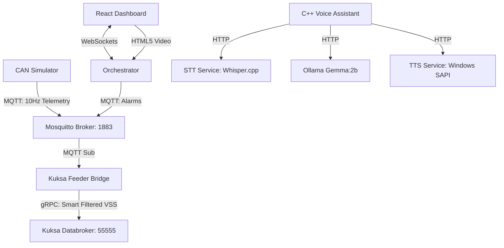

# EdgeDrive: Smart CAN Telematics & AI Simulator

**EdgeDrive** is an interactive, local-first in-vehicle telematics and smart dashboard simulator. It integrates a live physical vehicle simulator, an offline C++ AI Voice Assistant, camera-based ADAS alarms, and a standardized **Kuksa.val Databroker** using the **COVESA Vehicle Signal Specification (VSS)** over an **MQTT** messaging pipeline.

---

## 1. System Architecture



---

## 2. Key Components & Simulators

1. **CAN Simulator (`simulator/main.py`):** Runs a 10Hz physics loop simulating speed, engine RPM, transmission auto-shifting, GPS route traversal, and pedal positions (gas/brake). Emits raw telemetry via MQTT.
2. **Kuksa Databroker:** A standard Eclipse Kuksa.val gRPC server running in Docker. It serves as the in-vehicle database storing standardized vehicle parameters.
3. **Kuksa Feeder Bridge (`simulator/kuksa_feeder.py`):** Subscribes to MQTT topics, filters raw signals using smart delta limits (e.g., only update speed if it changes by >3.0 km/h or at a 15s heartbeat), and updates the Kuksa Databroker.
4. **Dashboard UI (`dashboard/`):** A modern React application that displays analog dials (speed, tachometer), pedal presses, map route tracking, and webcam feeds.
5. **AI Voice Assistant (`assistant_gui.cpp`):** A C++ Dear ImGui desktop application that uses offline Speech-to-Text (Whisper.cpp + CUDA), local Ollama LLM, and Windows SAPI Text-to-Speech to answer voice prompts.

---

## 3. Custom VSS Telemetry
To support advanced in-vehicle features that are not defined in the standard COVESA VSS schema, EdgeDrive programmatically injects custom nodes using [inject_custom_vss.py](file:///c:/Users/xtrem/Downloads/CPlusPlus/CAN%20CTRL/Kuksa-vss-data/inject_custom_vss.py):

* **Voice Assistant State Paths:**
  * `Vehicle.Cabin.VoiceAssistant.State` (string): e.g. `"IDLE"`, `"LISTENING"`, `"PROCESSING_STT"`, `"PROCESSING_LLM"`, `"SPEAKING"`.
  * `Vehicle.Cabin.VoiceAssistant.LastTranscribedText` (string): The last voice prompt transcribed.
  * `Vehicle.Cabin.VoiceAssistant.LastResponse` (string): The generated verbal response text.
* **ADAS Safety Paths:**
  * `Vehicle.ADAS.Cabin.IsSpeedAlarmActive` (boolean): Active speed alert (>120 km/h) indicators.

The injection script merges these custom paths with the base VSS JSON file and outputs `Kuksa-vss-data/custom_vss.json` for the Databroker to parse at startup.

---

## 4. Prerequisites

Ensure you have the following installed:
* **Docker Desktop** (for Mosquitto MQTT and Kuksa Databroker containers)
* **Python 3.x**
* **Node.js & npm** (for Dashboard UI)
* **CMake & C++ Compiler** (if rebuilding C++ STT/TTS microservices)

---

## 5. Installation

1. **Activate the Virtual Environment & Install Dependencies:**
   ```powershell
   # Activate Python environment
   .\venv\Scripts\activate
   
   # Install telematics packages
   pip install paho-mqtt websockets kuksa-client
   ```

2. **Install React Dashboard Packages:**
   ```powershell
   cd dashboard
   npm install
   cd ..
   ```

---

## 6. How to Run

A single, failproof launcher script automates the generation of custom schemas, stops existing Docker collisions, and spins up all 10 services in separate console windows.

Run the launcher batch file from the root directory:
```powershell
.\run_assistant.bat
```

### Services Launched:
* **TTS Microservice** (Port 8081)
* **STT Microservice** (Port 8080)
* **Ollama Server** (Port 11434)
* **Mosquitto MQTT Broker** (Port 1883)
* **Kuksa Databroker** (Port 55555)
* **Voice Assistant GUI** (C++ Desktop App)
* **CAN Physics Simulator** (WebSocket & MQTT)
* **CAN Orchestrator Server** (Port 8082)
* **Kuksa Feeder Bridge** (Telemetry Filter)
* **Dashboard UI** (Port 5173)
