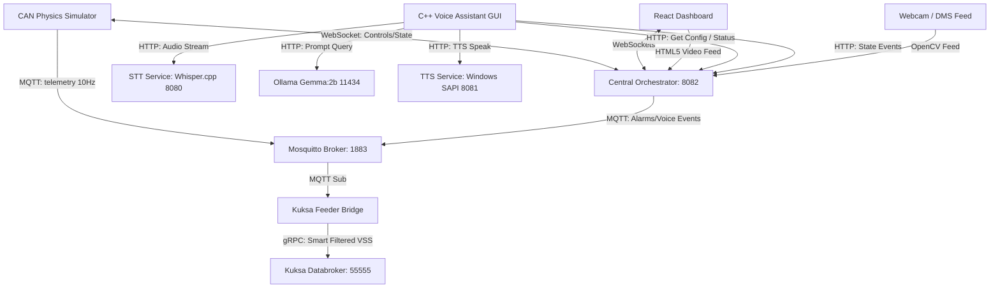

# EdgeDrive: Smart CAN Telematics & AI Simulator

**EdgeDrive** is an interactive, local-first in-vehicle telematics and smart dashboard simulator. It integrates a live physical vehicle simulator, an offline C++ AI Voice Assistant, camera-based ADAS alarms, and a standardized **Eclipse Kuksa.val Databroker** using the **COVESA Vehicle Signal Specification (VSS)** over an **MQTT** messaging pipeline.

---

## 1. System Architecture

The updated EdgeDrive architecture uses a centralized HTTP and WebSocket Orchestrator that coordinates the simulation, processes camera streams, tracks alarm states, and relays configuration metadata dynamically to both the dashboards and the C++ Voice Assistant.



---

## 2. Key Components

1. **CAN Simulator (`simulator/main.py`):** Runs a 10Hz physics loop simulating speed, engine RPM, transmission auto-shifting, GPS route traversal, pedal positions, fuel consumption, coolant temperature changes, cooling fan status, and individual tire pressures. It emits raw telemetry via MQTT and maintains a WebSocket server on port 8083.
2. **Central Orchestrator (`orchestrator/server.py`):** The communication core. It connects to the simulator via WebSockets, forwards dashboard controls, serves APIs (`/api/vehicle_status`, `/api/telemetry_config`), exposes camera feeds (`/video_feed`), runs the background Speed Alarm checks (with audio warning triggers), and publishes alarms via MQTT.
3. **Kuksa Databroker:** A standard Eclipse Kuksa.val gRPC server running in Docker, storing standardized vehicle parameters.
4. **Kuksa Feeder Bridge (`simulator/kuksa_feeder.py`):** Subscribes to MQTT topics, filters incoming signals using smart delta limits (e.g., speed changes of $\ge 3.0$ km/h or a 15-second heartbeat), and updates the Kuksa Databroker using standard VSS paths.
5. **Dashboard UI (`dashboard/`):** A modern React application that displays real-time dials (speedometer, tachometer), pedal presses, map route tracking, and webcam feeds.
6. **AI Voice Assistant (`assistant_gui.cpp`):** A C++ Dear ImGui desktop application that uses offline audio capture (`miniaudio`), local wake-word detection (`sherpa-onnx`), local speech-to-text (`Whisper.cpp`), local LLM response generation (`Ollama Gemma:2b`), and Text-to-Speech playback (`Windows SAPI`).

---

## 3. The Offline C++ Voice Assistant

### 3.1 Use Case
The Voice Assistant allows drivers to query and control vehicle systems hands-free without requiring an active internet connection. It is designed for privacy, speed, and reliability. Examples of user prompts:
* *"What is my current fuel level?"*
* *"Are my tire pressures safe?"*
* *"Is the engine overheating?"*

### 3.2 Development & Tech Stack
* **UI**: Developed using Dear ImGui and DirectX 11 for high-performance rendering.
* **Audio Capture/Playback**: Integrated using the single-header library `miniaudio.h`.
* **Local Wake-Word Engine**: Employs `sherpa-onnx` C-API utilizing a local ONNX model (transducer framework) to listen for the wake phrase *"Hello EdgeDrive"* or the stop command *"stop"*.
* **Speech-to-Text (STT)**: Queries the local Whisper.cpp C++ microservice (running at port 8080) by sending raw captured audio in WAV format.
* **Large Language Model (LLM)**: Interacts with Ollama's local `gemma:2b` server (port 11434) using an HTTP REST API.
* **Text-to-Speech (TTS)**: Queries a local Python microservice (port 8081) that invokes the native Windows SAPI (Speech API) to convert generated text into verbal responses.

### 3.3 Dynamic Response Workflow
```
[Capture Audio] ➔ [Wake Word Detected] ➔ [Record Audio (VAD: 1.5s silence)]
                        │
                        ▼
               [Whisper STT (8080)]
                        │
                        ▼  (Text Query)
   [Get Live Telemetry Context from Orchestrator (8082)]
                        │
                        ▼  (Inject Context & Prompt)
              [Ollama Gemma:2b (11434)]
                        │
                        ▼  (Response Text)
             [Windows SAPI TTS (8081)] ➔ [Verbal Response Playback]
```
During queries, the Voice Assistant pulls live telemetry fields marked `"llm_context": true` from the Orchestrator, dynamically injecting this state into the system instructions. For example, the LLM receives:
> *"You are the EdgeDrive vehicle AI Voice Assistant connected to the CAN bus. Current telemetry: Engine Status: RUNNING, Speed: 65 KMPH, Fuel Level: 84 %, Tyre Pressures: (FL=32, FR=32, RL=32, RR=32). Keep answers brief and natural."*

It then logs its current state (`LISTENING`, `PROCESSING_STT`, `PROCESSING_LLM`, `SPEAKING`, `IDLE`) back to the Orchestrator, which publishes it via MQTT to the Kuksa VSS paths `Vehicle.Cabin.VoiceAssistant.State`, `Vehicle.Cabin.VoiceAssistant.LastTranscribedText`, and `Vehicle.Cabin.VoiceAssistant.LastResponse`.

---

## 4. Configuration & Customization

### 4.1 Configuring the Simulator (`simulator/simulation_config.json`)
This file controls the physical properties and tick rates of simulated CAN sensors.

* **`tick_rate_hz`**: The frequency of the simulation loop (default is `10` Hz).
* **`sensors`**: Defines properties for each sensor:
  * `start`: Starting value when the simulation begins or resets.
  * `rate_per_tick`: The rate of decrease or increase per tick (100ms).
  * `clamp_min` / `clamp_max`: The physical boundaries.
  * `only_when_running`: If `true`, the value only decays/changes when the engine is running.
  * `fan_trigger_temp` / `fan_cooling_rate` (Coolant): Custom parameters for radiator cooling loops.

### 4.2 Configuring Telemetry Render & AI Settings (`orchestrator/telemetry_config.json`)
This file defines how telemetry fields are rendered in the dashboard interfaces, alerts are triggered, and if the LLM assistant is aware of them.

```json
{
  "key": "fuel_level",
  "label": "Fuel Level",
  "unit": "%",
  "type": "progress_bar",
  "max": 100.0,
  "warn_below": 15.0,
  "warn_label": "LOW FUEL!",
  "warn_tts_message": "Warning! Fuel level is critically low.",
  "llm_context": true
}
```
* **`type`**: Controls the ImGui visualization type (`progress_bar`, `boolean`, `text`, `grid_4`).
* **`warn_above` / `warn_below`**: Numerical boundaries that trigger safety alarm state changes.
* **`warn_tts_message`**: If configured, the Orchestrator will automatically trigger an out-of-band spoken TTS warning when the threshold is first crossed.
* **`llm_context`**: If `true`, this data point is automatically appended to the Voice Assistant's system prompt.

---

### 4.3 Custom VSS & Telemetry Extension Workflow
To add and monitor a new telemetry attribute (e.g., **Battery Temperature** or **State of Charge (SoC)**):

```
1. Add property config to simulator/simulation_config.json
   (e.g., "battery_temp": {"start": 25.0, "rate_per_tick": 0.01})
                          │
                          ▼
2. Update simulator/main.py to simulate physical changes and add to MQTT telemetry payload
                          │
                          ▼
3. Define the COVESA VSS node path in Kuksa-vss-data/inject_custom_vss.py
   (e.g., "Vehicle.Powertrain.TractionBattery.StateOfCharge")
                          │
                          ▼
4. Add mapping & smart delta filter logic in simulator/kuksa_feeder.py
                          │
                          ▼
5. Register the field in orchestrator/telemetry_config.json to visualize it and enable Voice AI
```

---

## 5. Glossary of Terms

### 5.1 Automotive & Telematics Concepts
* **CAN (Controller Area Network):** A robust vehicle bus standard designed to allow microcontrollers and devices to communicate with each other's applications without a host computer. It operates as a message-based broadcast protocol.
  * **Classical CAN:** Offers a payload size of up to 8 bytes per frame and a maximum transmission speed of 1 Mbps.
  * **CAN FD (Flexible Data-rate):** A modern extension supporting payloads up to 64 bytes per frame and dynamic bit-rate switching, reaching speeds up to 5 Mbps (or higher depending on transceiver hardware).
  * **CAN XL (Extra Large):** The next-generation CAN standard supporting up to 2048 bytes of payload and speeds exceeding 10 Mbps, bridging the gap between CAN and Automotive Ethernet.
* **ADAS (Advanced Driver Assistance Systems):** Electronic systems that assist drivers in driving and parking functions, utilizing automated technologies (e.g., sensors and cameras).
  * **Level 0 (No Automation):** The driver performs all tasks. The system may provide momentary warnings (e.g., blind spot alerts).
  * **Level 1 (Driver Assistance):** The vehicle controls either steering OR speed (e.g., Lane Keep Assist or Adaptive Cruise Control).
  * **Level 2 (Partial Automation):** The vehicle controls steering AND speed simultaneously (e.g., Tesla Autopilot). The driver must monitor the environment at all times.
  * **Level 3 (Conditional Automation):** The vehicle monitors the environment and drives itself under specific conditions, but the driver must be ready to take over when prompted.
  * **Level 4 (High Automation):** The vehicle can drive itself entirely under specific geofenced conditions without driver intervention.
  * **Level 5 (Full Automation):** Complete automation in all driving scenarios. No steering wheel or pedals required.
* **COVESA (Connected Vehicle Systems Alliance):** A global development alliance focused on accelerating the adoption of open standards for connected vehicle systems. They maintain the **Vehicle Signal Specification (VSS)**, which organizes vehicle signals (sensors, actuators, attributes) into a standard, unified tree hierarchy.
* **Eclipse Kuksa:** An open-source project providing a standard in-vehicle databroker (`kuksa.val`). It hosts VSS telemetry tree schemas locally, allowing internal applications (dashboard, speech assistant) to fetch or subscribe to vehicle signals using standard gRPC or WebSocket protocols.
* **CAN Hardware Interfaces:** To interface physical computers with a vehicle's CAN bus, specialized hardware is plugged in:
  * **OBD-II Dongles (e.g., ELM327 / STN1110):** Low-cost consumer plugs that translate CAN messages to serial protocols over USB, Bluetooth, or Wi-Fi.
  * **Dedicated Transceivers & Microcontrollers (e.g., MCP2515 + Arduino/ESP32):** Used to build DIY hardware nodes that read/write CAN signals directly.
  * **USB-to-CAN Adapters (e.g., PCAN-USB, Kvaser, or CandleLight):** Professional diagnostic interfaces that bridge physical CAN lines to native OS sockets (SocketCAN on Linux).
  * **Fleet Telematics Units (Black Boxes):** Industrial cellular-enabled hubs containing GPS, accelerometers, and CAN transceivers that collect, store, and stream data to remote cloud platforms.

### 5.2 Fleet Management & Real-World Case Studies

#### Fleet Telemetry Rationale
Telematics data is crucial for operations to optimize asset utilization, control costs, improve safety, and automate maintenance.

#### 1. Zoomcar (P2P Car Sharing / Rental)
* **Use Case:** A peer-to-peer car sharing platform needs to track vehicle locations, prevent theft, and enforce usage policies.
* **Key Signals Monitored:**
  * **GPS coordinates (`Vehicle.CurrentLocation`):** Enables geofencing (raising alarms if a vehicle leaves a designated city/region).
  * **Engine Running State & Door Lock Status:** Confirms the vehicle is locked/unlocked via remote command APIs and prevents engine start unless an active booking is verified.
  * **Odometer & Fuel Level:** Automatically calculates rental billing based on distance traveled and fuel consumed.
  * **Seatbelt & Speed Violations:** Tracks aggressive driving behavior to penalize users who abuse rental vehicles.

#### 2. Ather Energy (Smart Electric Scooters)
* **Use Case:** An electric two-wheeler manufacturer utilizes continuous telemetry to monitor vehicle health, optimize battery parameters, and push over-the-air (OTA) software updates.
* **Key Signals Monitored:**
  * **Battery State of Charge (SoC), State of Health (SoH), and Cell Temperatures:** Critical for battery management system (BMS) diagnostics to prevent thermal runaway.
  * **Tire Pressure Monitoring System (TPMS):** Alerts riders on the smart dashboard and companion app of low tire pressure to maximize range and safety.
  * **Inertial Measurement Unit (IMU) Data (Roll, Pitch, Yaw):** Detects crashes or fall-over events, automatically raising roadside assistance alerts or shutting down the high-voltage drivetrain.

---

## 6. Troubleshooting & Operational Scenarios

### 6.1 Telematics Troubleshooting Examples
* **Noisy/Bouncing Sensors (False Positives):** A sensor (e.g., coolant temperature) fluctuating rapidly due to electromagnetic interference on physical CAN wires. 
  * *Fix:* Implement software-based hysteresis or rolling average filters (debounce logic) before publishing states.
* **Dropped Packet Detection:** Due to intermittent cellular connectivity in rural areas, telemetry packets are dropped.
  * *Fix:* The telematics unit must use local storage buffers (store-and-forward) and publish backlogged telemetry once connection is re-established.
* **High Latency in Kuksa Updates:** Heavy traffic on the MQTT broker slows down gRPC writes to the databroker.
  * *Fix:* Implement **Smart Logging** (as done in `kuksa_feeder.py`), where signals are only sent if they cross a certain delta threshold (e.g., speed change > 3.0 km/h) or during a slow periodic heartbeat, drastically reducing network load.

### 6.2 Live Video Feeds & Vehicle Movement Rationale
* **Live Feeds (Dashcam/DMS):** EdgeDrive integrates a live video endpoint `/video_feed` simulating dual cameras.
  * **Dashcam (Front-Facing):** Runs object detection models to spot vehicles, pedestrians, and lanes. Used for real-time collision warning alarms.
  * **Driver Monitoring System (DMS) (Cabin-Facing):** Tracks driver facial landmarks to detect drowsiness (eyes closed) or distraction (looking away).
  * **Why Live Feed is Essential:** Providing visual validation ensures that warning signals (beeps, flashing indicators) align directly with real-world obstacles or driver behavior, minimizing liability and validating automated driving actions for insurance or fleet oversight.

### 6.3 Variable Polling Intervals in Fleet Management
Not all data points require the same transmission frequency. Polling intervals are customized based on signal dynamics and operational priorities:

| Attribute | Polling Interval | Rationale | Example Case (Zoomcar / Ather) |
| :--- | :--- | :--- | :--- |
| **GPS Location & Speed** | High (1Hz - 10Hz) | Critical for tracking route deviations, geo-fence breaches, and speed limit violations in real-time. | Immediate notifications when a Zoomcar crosses speed limits. |
| **Battery Voltage & Drivetrain Temperature** | Medium (5s - 15s) | Changes quickly under hard acceleration but does not require sub-second updates for fleet logging. | Monitoring thermal buildup during steep climbs on an Ather scooter. |
| **Fuel Level & Odometer** | Low (30s - 2m) | Changes slowly and is mostly needed for trip-start/trip-end billing calculations. | Calculating fuel usage at the end of a rental ride. |
| **Tire Pressure (TPMS) / Diagnostic Trouble Codes (DTC)** | Event-Driven (Only on change/fault) | TPMS is static under normal conditions. Immediate alert is only needed if pressure drops suddenly or a hardware fault code appears. | Ather dashboard showing a tire puncture alert immediately upon a sudden pressure drop. |
