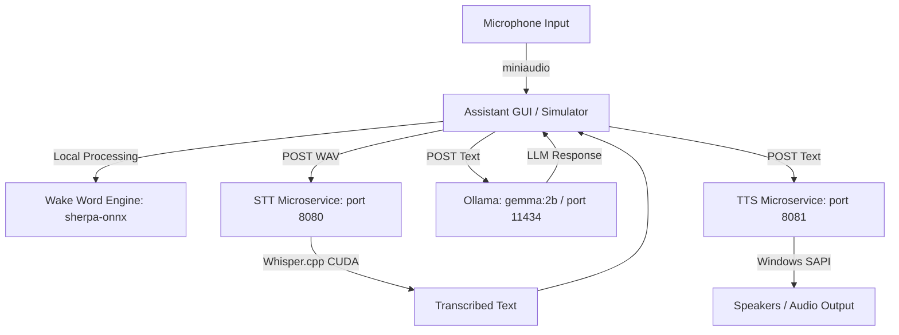

# C++ Voice Assistant (Siri/Alexa-like) Microservices & ImGui Simulator

This plan outlines the design and implementation of a modular, offline C++ voice assistant. It consists of three decoupled components: an **STT Microservice** (Whisper.cpp), a **TTS Microservice** (Windows SAPI), and an **ImGui Simulator GUI** that handles audio capture, wake-word detection (sherpa-onnx), and orchestration via Ollama.

---

## Proposed Architecture

We will structure the workspace into three independent C++ projects managed by a unified CMake build system:



### 1. STT Microservice (`stt_service`)
* **Endpoint:** `POST /transcribe`
* **Technology:** `cpp-httplib` + `whisper.cpp` (compiled with CUDA acceleration).
* **Behavior:** Receives raw audio data (WAV format) in the request body, transcribes it using Whisper's `base` model, and returns a JSON payload: `{"text": "transcribed text"}`.

### 2. TTS Microservice (`tts_service`)
* **Endpoint:** `POST /speak`
* **Technology:** `cpp-httplib` + Windows SAPI (`sapi.h` using the `ISpVoice` COM interface).
* **Behavior:** Receives a JSON payload `{"text": "text to speak"}` and uses the built-in Windows voice ("Microsoft David" or "Microsoft Zira") to speak the text out loud offline.

### 3. Orchestration & Simulator GUI (`assistant_gui`)
* **GUI Framework:** Dear ImGui with DirectX 11 backend (native to Windows).
* **Audio Capture:** `miniaudio` capturing microphone input in a background thread.
* **Wake Word Engine:** `sherpa-onnx` running a pre-trained keyword spotter model (such as ZIPFormer trained for "Alexa" or "Jarvis").
* **Orchestration Flow:**
  1. **Idle State:** Microphone audio is continuously analyzed by `sherpa-onnx` looking for the wake word. ImGui displays a gentle "resting" audio visualizer.
  2. **Wake Word Triggered:** GUI visualizer highlights green, transitions to the **Listening** state, and records speech until silence/pause is detected.
  3. **Transcribing:** The GUI sends the recorded WAV audio to `http://localhost:8080/transcribe`.
  4. **Thinking:** The transcribed text is sent to the local **Ollama** server running `gemma:2b` (`http://localhost:11434/api/generate`).
  5. **Speaking:** The LLM's text response is sent to `http://localhost:8081/speak`.
  6. **Return to Idle:** GUI returns to waiting for the next wake word.

---

## User Review Required

> [!IMPORTANT]
> **Dependencies & Download Details:**
>
> 1. **CUDA Integration:** Confirmed installed. Whisper.cpp will be compiled with CUDA support (`GGML_CUDA=ON`).
> 2. **miniaudio.h:** Will be downloaded from:
>    `https://raw.githubusercontent.com/mackron/miniaudio/master/miniaudio.h`
> 3. **Dear ImGui:** Will be added as a git submodule pointing to the official repository:
>    `https://github.com/ocornut/imgui.git`
> 4. **sherpa-onnx Framework & Model:**
>    - Pre-compiled Windows x64 Shared library downloaded from:
>      `https://github.com/k2-fsa/sherpa-onnx/releases/download/v1.13.2/sherpa-onnx-v1.13.2-win-x64-shared-MD-Release.tar.bz2`
>    - Pre-trained Zipformer Keyword Spotting Model (Gigaspeech English) downloaded from:
>      `https://github.com/k2-fsa/sherpa-onnx/releases/download/kws-models/sherpa-onnx-kws-zipformer-gigaspeech-3.3M-2024-01-01.tar.bz2`
> 5. **Whisper.cpp Framework & Model:**
>    - Submodule URL: `https://github.com/ggerganov/whisper.cpp.git`
>    - Model (base): `https://huggingface.co/ggerganov/whisper.cpp/resolve/main/ggml-base.bin`

---

## Proposed Changes

### Build Configuration

#### [NEW] [CMakeLists.txt](file:///c:/Users/xtrem/Downloads/CPlusPlus/test%20project/CMakeLists.txt)
We will rewrite the root `CMakeLists.txt` to define the three sub-projects: `stt_service`, `tts_service`, and `assistant_gui`.

### External Dependencies Setup

#### [NEW] [setup_dependencies.ps1](file:///c:/Users/xtrem/Downloads/CPlusPlus/test%20project/setup_dependencies.ps1)
A PowerShell script to automatically pull Git submodules, download `miniaudio.h`, extract `sherpa-onnx` and the Zipformer model, and fetch the Whisper `base` model.

### Speech to Text (STT) Microservice

#### [NEW] [stt_service.cpp](file:///c:/Users/xtrem/Downloads/CPlusPlus/test%20project/stt_service.cpp)
A C++ microservice linking to Whisper.cpp that hosts the `/transcribe` endpoint.

### Text to Speech (TTS) Microservice

#### [NEW] [tts_service.cpp](file:///c:/Users/xtrem/Downloads/CPlusPlus/test%20project/tts_service.cpp)
A C++ microservice using SAPI (`sapi.h`) that hosts the `/speak` endpoint.

### Assistant GUI / Simulator

#### [NEW] [assistant_gui.cpp](file:///c:/Users/xtrem/Downloads/CPlusPlus/test%20project/assistant_gui.cpp)
The core simulation GUI using Dear ImGui, DirectX 11, `miniaudio`, and `sherpa-onnx` client bindings.

---

## Verification Plan

### Automated / Manual Verification
1. **Compile Verification:** Compile all three targets using CMake:
   ```powershell
   cmake -B build -S .
   cmake --build build --config Release
   ```
2. **STT Service Test:** Run `stt_service.exe` and send a mock WAV audio file using `curl`/PowerShell to verify it returns JSON text.
3. **TTS Service Test:** Run `tts_service.exe` and send a JSON text payload to verify your computer speaks it out loud.
4. **End-to-End Test:** Run the Ollama model (`gemma:2b`), launch all three services, speak the wake word, observe the GUI visualizer feedback, say a prompt, and verify that the system transcribes it, queries Ollama, and speaks the response back.
