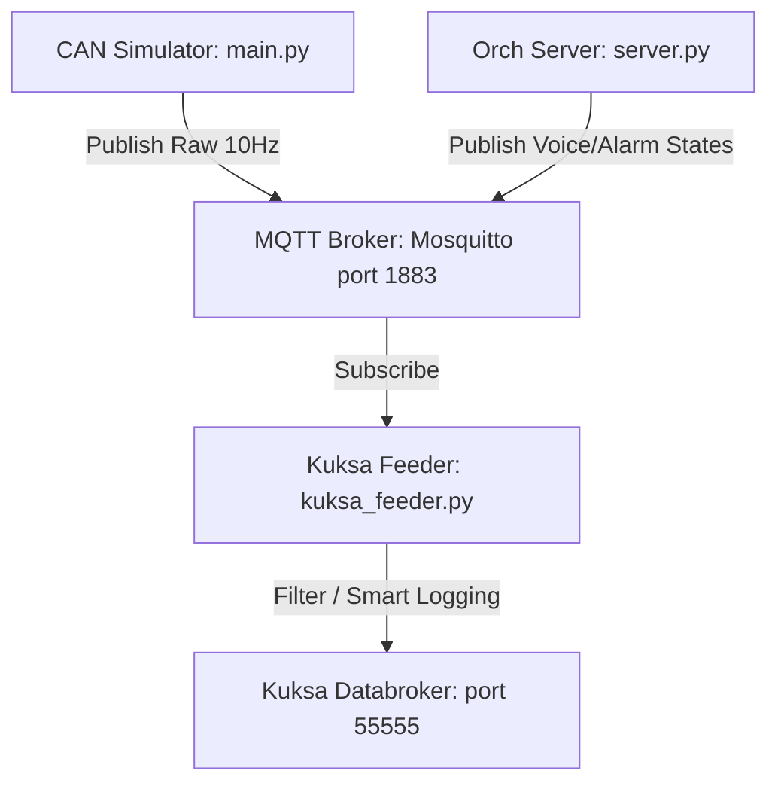

# Implementation Plan - MQTT, Custom VSS Telemetry, and Smart Event Logging

This plan outlines the design and steps to upgrade our CAN simulator telemetry pipeline to simulate standard IoT fleet management practices. We will introduce MQTT, define custom VSS signals, and implement smart event-driven logging.

---

## Proposed Architecture

1. **MQTT Broker (Eclipse Mosquitto):** Run in Docker to handle all in-vehicle message publish/subscribe routing.
2. **Custom VSS Definition:** Programmatically extend `vss_rel_4.1_noexpand.json` to support voice assistant state, speed alarms, and camera alerts.
3. **Smart Event Feeder:** The feeder script will subscribe to MQTT, filter out redundant updates (using delta thresholds), and only publish meaningful changes to Kuksa Databroker.

---

## Proposed Changes

### Build & Environment Setup

#### [NEW] [inject_custom_vss.py](file:///c:/Users/xtrem/Downloads/CPlusPlus/CAN%20CTRL/Kuksa-vss-data/inject_custom_vss.py)
A helper script to inject our custom attributes into the standard VSS JSON tree and output `custom_vss.json` so the Databroker recognizes them.
Custom attributes to inject:
* `Vehicle.Cabin.VoiceAssistant.State` (DataType: `string`)
* `Vehicle.Cabin.VoiceAssistant.LastTranscribedText` (DataType: `string`)
* `Vehicle.Cabin.VoiceAssistant.LastResponse` (DataType: `string`)
* `Vehicle.ADAS.Cabin.IsSpeedAlarmActive` (DataType: `boolean`)

#### [MODIFY] [run_assistant.bat](file:///c:/Users/xtrem/Downloads/CPlusPlus/CAN%20CTRL/run_assistant.bat)
* Launch Eclipse Mosquitto on port `1883`.
* Run `inject_custom_vss.py` to prepare the JSON.
* Start Kuksa Databroker using `custom_vss.json` instead of the default JSON.

---

### Telemetry Services

#### [MODIFY] [main.py](file:///c:/Users/xtrem/Downloads/CPlusPlus/CAN%20CTRL/simulator/main.py)
* Install `paho-mqtt` dependency in the virtual environment.
* Change simulator telemetry output from hosting a WebSocket server to publishing payloads to the local MQTT broker at `localhost:1883` on topic `vehicle/simulator/telemetry`.

#### [MODIFY] [server.py](file:///c:/Users/xtrem/Downloads/CPlusPlus/CAN%20CTRL/orchestrator/server.py)
* Publish alarm states (`is_over_120`) to MQTT topic `vehicle/orchestrator/alarms`.
* Publish mock camera distraction/voice assistant triggers (if active) to `vehicle/orchestrator/voice`.

#### [MODIFY] [kuksa_feeder.py](file:///c:/Users/xtrem/Downloads/CPlusPlus/CAN%20CTRL/simulator/kuksa_feeder.py)
Rewrite the feeder to:
1. Subscribe to MQTT topics (`vehicle/simulator/telemetry`, `vehicle/orchestrator/alarms`, `vehicle/orchestrator/voice`).
2. Implement **Smart Logging Filters**:
   * **Speed:** Only update `Vehicle.Speed` if it changes by $> 3.0$ km/h from the last published speed, OR if 15 seconds have passed (heartbeat).
   * **RPM:** Only update `Vehicle.Powertrain.CombustionEngine.Speed` if it changes by $> 200$ rpm.
   * **State Changes:** Update immediately if `started`, `gear`, or `IsSpeedAlarmActive` changes.
3. Map and write the custom signals to the Databroker.

---

## Verification Plan

### Automated / Manual Verification
1. **MQTT Check:** Verify Mosquitto broker is running and accepting connections.
2. **Custom VSS Check:** Fetch `Vehicle.Cabin.VoiceAssistant.State` from Kuksa Databroker and verify it returns a valid (uninitialized/empty) response instead of a path-not-found error.
3. **Smart Logging Check:** Run the simulator, hold the gas pedal, and observe the feeder's log. Verify that updates to `Vehicle.Speed` are not sent 10 times a second, but instead print only when speed increases significantly (delta threshold met).
4. **Alarms/Custom Signal Check:** Trigger the speed warning (>120 km/h) and verify that `Vehicle.ADAS.Cabin.IsSpeedAlarmActive` immediately flips to `True` in the Databroker.
