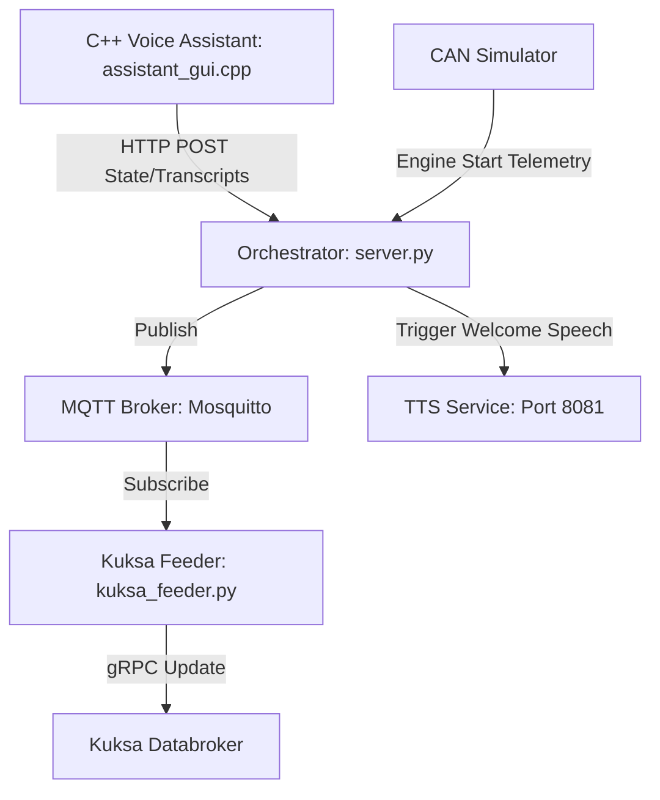

# Implementation Plan - Live Voice Assistant Telemetry & Automated Welcome TTS

This plan integrates the live C++ Voice Assistant with the Kuksa Databroker (replacing the mock data) and adds an automated Welcome TTS message when the engine starts.

---

## Proposed Architecture



1. **Voice Assistant Integration:**
   * Modify `assistant_gui.cpp` to POST voice state, query transcripts, and response text to the Orchestrator on `/api/voice_event` whenever a state change occurs.
   * Modify `orchestrator/server.py` to expose `/api/voice_event` and publish it to MQTT topic `vehicle/voice_assistant/events`.
   * Update `kuksa_feeder.py` to subscribe to `vehicle/voice_assistant/events`, remove the mock simulation loop, and write real voice telemetry directly to Kuksa Databroker.

2. **Automated Welcome TTS on Start:**
   * Modify `orchestrator/server.py` to detect when the vehicle's `started` telemetry transitions from `False` to `True`.
   * Trigger a background thread to call the TTS service `/speak` endpoint with: `"Yes, the engine is currently running. welcome, Always maintain a safe distance from the vehicle in front of you."`

---

## Proposed Changes

### 1. Voice Assistant Client (C++)

#### [MODIFY] [assistant_gui.cpp](file:///c:/Users/xtrem/Downloads/CPlusPlus/CAN%20CTRL/assistant_gui.cpp)
* Add a `report_voice_state()` helper function that makes an asynchronous HTTP POST call to `http://localhost:8082/api/voice_event`.
* Add a `clean_for_json()` helper function to sanitize strings (escaping double quotes) before sending.
* Insert `report_voice_state()` calls at all state transition points:
  * When entering `STATE_LISTENING` (Wake word detected).
  * When entering `STATE_PROCESSING_STT` (Start transcribing).
  * When entering `STATE_PROCESSING_LLM` (Send query text).
  * When entering `STATE_SPEAKING` (TTS speaking response).
  * When returning to `STATE_IDLE`.

---

### 2. Orchestrator Relay & Welcome TTS (Python)

#### [MODIFY] [server.py](file:///c:/Users/xtrem/Downloads/CPlusPlus/CAN%20CTRL/orchestrator/server.py)
* Add a new Pydantic schema `VoiceEvent` and FastAPI endpoint `/api/voice_event` to receive HTTP updates from the Voice Assistant.
* Forward incoming voice events to MQTT topic `vehicle/voice_assistant/events`.
* Track `last_started` status inside `connect_to_simulator()`. On transition from `False` to `True`, spawn a background thread using `urllib.request` to speak the welcome message:
  `"Yes, the engine is currently running. welcome, Always maintain a safe distance from the vehicle in front of you."`

---

### 3. Feeder Bridge (Python)

#### [MODIFY] [kuksa_feeder.py](file:///c:/Users/xtrem/Downloads/CPlusPlus/CAN%20CTRL/simulator/kuksa_feeder.py)
* Subscribe to the new MQTT topic `vehicle/voice_assistant/events`.
* Write incoming voice telemetry (State, LastTranscribedText, LastResponse) directly to Kuksa VSS paths.
* **Remove** the background `mock_voice_assistant` task so it no longer generates simulated voice events.

---

## Verification Plan

### Automated / Manual Verification
1. **Compilation:** Compile the updated `assistant_gui.cpp` file using:
   ```powershell
   cmake --build build --config Release --target assistant_gui
   ```
2. **Start Services:** Start all services via `run_assistant.bat`.
3. **Automated TTS Verification:** 
   * Open the React Dashboard and press the `S` key to start the engine.
   * Verify that the voice speaker plays the welcome message: *"Yes, the engine is currently running. welcome, Always maintain a safe distance from the vehicle in front of you."*
4. **Live Voice Telemetry Verification:**
   * Say the wake word *"Covesa"* (or press trigger button).
   * Verify using a VSS query that `Vehicle.Cabin.VoiceAssistant.State` transitions live: `LISTENING` $\rightarrow$ `PROCESSING_STT` $\rightarrow$ `PROCESSING_LLM` $\rightarrow$ `SPEAKING` $\rightarrow$ `IDLE`.
   * Verify that the exact transcribed text and LLM spoken response appear inside `Vehicle.Cabin.VoiceAssistant.LastTranscribedText` and `LastResponse` in the Kuksa Databroker.
