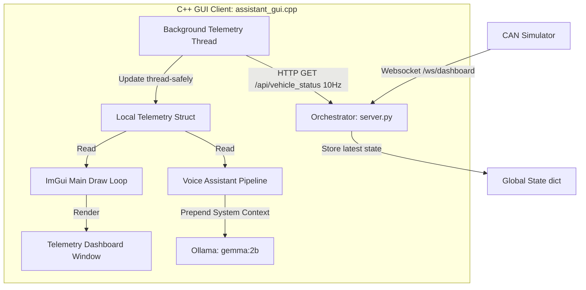

# Implementation Plan - Query Vehicle Status & Telemetry Dashboard Window

This plan outlines how to enable the C++ Voice Assistant to display vehicle telemetry in a dedicated overlay window and answer questions about the current vehicle status.

---

## Proposed Architecture



1. **Python Orchestrator ([server.py](file:///c:/Users/xtrem/Downloads/CPlusPlus/CAN%20CTRL/orchestrator/server.py)):**
   * Maintain a global `vehicle_state` dictionary that caches the latest telemetry messages received from the CAN Simulator.
   * Expose a new HTTP GET endpoint `/api/vehicle_status` that returns the cached dictionary as JSON.

2. **C++ GUI Client ([assistant_gui.cpp](file:///c:/Users/xtrem/Downloads/CPlusPlus/CAN%20CTRL/assistant_gui.cpp)):**
   * **Background Telemetry Thread:** Spawns a background thread at startup that performs a non-blocking HTTP GET request to `/api/vehicle_status` at 10Hz (every 100ms) and updates a thread-safe global `g_telemetry` struct.
   * **Dashboard Window:** Adds a new ImGui window named `"Vehicle Telemetry Dashboard"` displaying:
     * Engine Status (Running/Stopped)
     * Gear
     * Current Speed (with alert styling if Speed Alarm is active) and a Speed Meter progress bar.
     * Engine RPM and an RPM Meter progress bar.
   * **Voice Assistant Context:** Directly reads the locally cached thread-safe `g_telemetry` struct during the query pipeline and formats it as a `system` context message for the LLM.

---

## Proposed Changes

### 1. Orchestrator Telemetry Cache & API Endpoint
#### [MODIFY] [server.py](file:///c:/Users/xtrem/Downloads/CPlusPlus/CAN%20CTRL/orchestrator/server.py)
* Initialize a global dictionary variable:
  ```python
  vehicle_state = {
      "speed": 0.0,
      "rpm": 0,
      "gear": 1,
      "started": False,
      "speed_alarm": False
  }
  ```
* In `connect_to_simulator()` inside the websocket message receiver block, update the global `vehicle_state` dict with the latest values (including `is_over_120`).
* Expose a FastAPI route:
  ```python
  @app.get("/api/vehicle_status")
  def get_vehicle_status():
      global vehicle_state
      return vehicle_state
  ```

---

### 2. C++ GUI Client: Thread-Safe Telemetry & UI Window
#### [MODIFY] [assistant_gui.cpp](file:///c:/Users/xtrem/Downloads/CPlusPlus/CAN%20CTRL/assistant_gui.cpp)
* Define a thread-safe `VehicleTelemetry` structure, mutex, and control variable:
  ```cpp
  struct VehicleTelemetry {
      float speed = 0.0f;
      int rpm = 0;
      int gear = 1;
      bool started = false;
      bool speed_alarm = false;
  };
  VehicleTelemetry g_telemetry;
  std::mutex telemetry_mutex;
  bool telemetry_thread_running = true;
  ```
* Implement the background thread function `telemetry_fetch_worker()` that queries `/api/vehicle_status` every 100ms and parses the JSON response into `g_telemetry`. Start this thread at the beginning of `main()`.
* In `process_audio_pipeline()`, retrieve the telemetry snapshot thread-safely:
  ```cpp
  VehicleTelemetry tel;
  {
      std::lock_guard<std::mutex> lock(telemetry_mutex);
      tel = g_telemetry;
  }
  ```
  Inject these metrics directly into the LLM system prompt prefix:
  `"Current vehicle telemetry state: Speed: <speed> KMPH, RPM: <rpm>, Gear: <gear>, Engine Status: <started>, Speed Alarm: <speed_alarm>."`
* Inside the main ImGui loop, add code to draw the dashboard window:
  ```cpp
  ImGui::Begin("Vehicle Telemetry Dashboard");
  // Displays engine status, gear, speed, RPM, and visual meters (progress bars)
  ImGui::End();
  ```
* Stop the worker thread on window exit by setting `telemetry_thread_running = false` before cleaning up.

---

## Verification Plan

### Automated / Manual Verification
1. **Compilation (To be run by user):**
   ```powershell
   cmake --build build --config Release --target assistant_gui
   ```
2. **Start Services:** Start all services via `run_assistant.bat`.
3. **Dashboard Window Verification:**
   * Observe that a new window titled `"Vehicle Telemetry Dashboard"` appears in the GUI.
   * Drive the simulator and verify the speed/RPM progress bars and alarms react instantly at 10Hz.
4. **Manual Query Testing:**
   * Accelerate the vehicle to 60 km/h.
   * Ask the voice assistant: *"How fast am I driving?"*
   * Verify that the spoken response matches the current speed on the dashboard.
